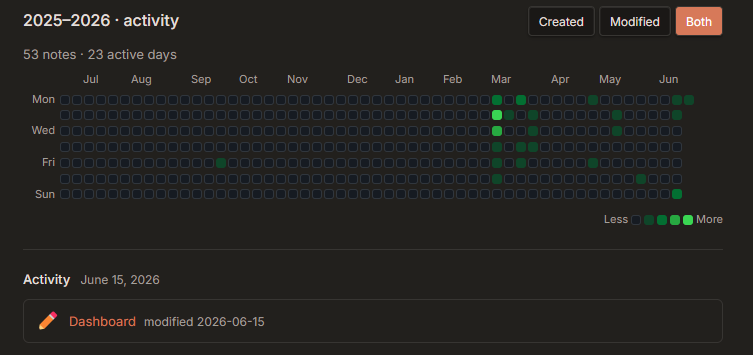

# Obsidian Activity Calendar

A GitHub-style activity heatmap for [Obsidian](https://obsidian.md), built with [Dataview](https://github.com/blacksmithgu/obsidian-dataview).

Tracks note creation and editing activity across the past year — click any day to see what you worked on.



---

## Features

- **Heatmap** — 52-week GitHub-style calendar, color intensity scales with activity
- **Three modes** — view created notes, modified notes, or both together
- **Click to inspect** — click any active day to see the list of notes with links
- **Smart deduplication** — notes created and modified on the same day are counted once
- **Responsive** — adapts cell size to the available panel width

---

## Requirements

- [Obsidian](https://obsidian.md) v1.0+
- [Dataview plugin](https://github.com/blacksmithgu/obsidian-dataview) with **DataviewJS enabled**

To enable DataviewJS: `Settings → Dataview → Enable DataviewJS`

---

## Installation

1. Copy the contents of `activity-calendar.md` (the DataviewJS code block)
2. Paste it into any note in your vault
3. Switch to **Reading view** — the calendar renders automatically

Or place it on your dashboard / homepage note.

---

## Usage

| Control | Action |
|---|---|
| **Created** button | Show only days when notes were created |
| **Modified** button | Show only days when notes were edited |
| **Both** button | Show combined activity (default) |
| Click a day cell | Show all notes active on that day |

---

## How it works

The script uses Dataview's `p.file.cday` (creation date) and `p.file.mday` (modification date) fields, which Obsidian populates automatically from file metadata.

Activity is aggregated into a 365-day grid. Color thresholds:

| Color | Activity |
|---|---|
| ⬛ Dark gray | 0 notes |
| 🟩 Light green | 1–2 notes |
| 🟩 Green | 3–5 notes |
| 🟩 Medium green | 6–9 notes |
| 🟩 Bright green | 10+ notes |

---

## Customization

At the top of the script you can adjust:

```js
const COLORS = ["#161b22","#0e4429","#006d32","#26a641","#39d353"];
const THRESHOLDS = [0, 1, 3, 6, 10];
```

`THRESHOLDS` — minimum note count to reach each color level.  
`COLORS` — hex values for each level, from empty to most active.

---

## License

MIT
